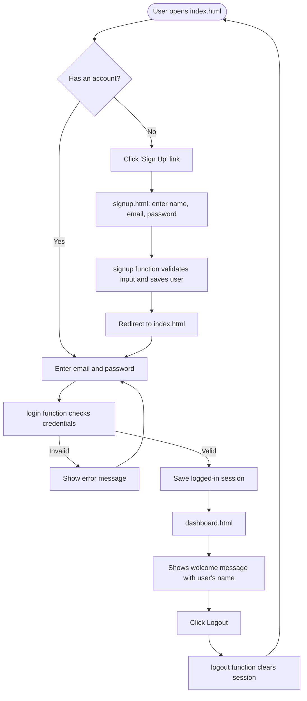

# 🔐 Login & Signup Web App

A simple front-end authentication app built with **HTML, CSS, and vanilla JavaScript**. Users can create an account, log in, see a personalized dashboard, and log out. No frameworks, no build tools, no backend required.

---

## 📑 Table of Contents

- [Features](#-features)
- [Tech Stack](#-tech-stack)
- [Project Structure](#-project-structure)
- [Getting Started](#-getting-started)
- [App Flow](#-app-flow)
- [How It Works](#-how-it-works)
- [Pages Explained](#-pages-explained)
- [Customization](#-customization)
- [Security Notice](#-security-notice)
- [Future Improvements](#-future-improvements)
- [Contributing](#-contributing)
- [License](#-license)

---

## ✨ Features

- Clean, modern, responsive card-style UI
- Sign up with full name, email, and password
- Login with email and password
- Personalized welcome message on the dashboard
- Logout functionality
- Works fully in the browser, with no server or database setup

---

## 🛠 Tech Stack

| Layer      | Technology                                   |
|------------|----------------------------------------------|
| Structure  | HTML5                                        |
| Styling    | CSS3 (Flexbox, custom card design)           |
| Logic      | Vanilla JavaScript (`script.js`)             |
| Storage    | Browser Web Storage (`localStorage`)         |

---

## 📁 Project Structure

```
project-folder/
│
├── index.html        # Login page (entry point)
├── signup.html       # Registration page
├── dashboard.html    # Protected page shown after login
├── script.js         # All app logic: signup, login, logout, session check
└── README.md         # Project documentation
```

---

## 🚀 Getting Started

### Prerequisites

You only need a modern web browser (Chrome, Firefox, Edge, Safari). No installation is required.

### Option 1: Open directly (easiest)

1. Download or clone the repository:
   ```bash
   git clone https://github.com/your-username/your-repo-name.git
   ```
2. Open the project folder.
3. Double-click **`index.html`** to open it in your browser.

### Option 2: Use VS Code Live Server

1. Open the folder in **VS Code**.
2. Install the **Live Server** extension.
3. Right-click `index.html` and choose **Open with Live Server**.

### Option 3: Use a local server

```bash
# Python 3
python -m http.server 8000

# or Node.js
npx serve
```

Then visit `http://localhost:8000` in your browser.

---

## 🔄 App Flow



### Step-by-step user journey

1. **Open the app.** The login page (`index.html`) loads first.
2. **New user?** Click **Sign Up** to go to `signup.html`.
3. **Register.** Enter your full name, email, and password, then click **Sign Up**.
4. **Log in.** Back on the login page, enter your email and password, then click **Login**.
5. **Dashboard.** On success you land on `dashboard.html`, which greets you by name.
6. **Logout.** Click **Logout** to end the session and return to the login page.

---

## ⚙️ How It Works

All pages share a single script, `script.js`, which each page loads at the bottom of the `<body>`. Buttons call functions from this file using inline `onclick` handlers.

| Page             | Element / Trigger                  | Function called   | Purpose                                      |
|------------------|------------------------------------|-------------------|----------------------------------------------|
| `signup.html`    | **Sign Up** button                 | `signup(event)`   | Reads name, email, password and creates account |
| `index.html`     | **Login** button                   | `login(event)`    | Verifies credentials and starts a session    |
| `dashboard.html` | **Logout** button                  | `logout()`        | Ends the session and redirects to login      |
| `dashboard.html` | `<h2 id="welcome">`                | (on page load)    | Displays the logged-in user's name           |

### Data handling

- User data is stored in the browser's **`localStorage`**, so it persists after refreshing or closing the tab.
- Each input field is read by its `id` (`name`, `email`, `password`).
- The `event` parameter passed to `login(event)` and `signup(event)` lets the script call `event.preventDefault()` if needed.
- The dashboard checks for a logged-in user on load. If no one is logged in, it should redirect back to `index.html`.

> **Note:** Update this section if your `script.js` uses a different storage method (for example `sessionStorage` or a backend API).

---

## 📄 Pages Explained

### `index.html` (Login)
- Fields: **E-Mail** and **Password**
- Button: **Login**, which runs `login(event)`
- Link to `signup.html` for new users

### `signup.html` (Sign Up)
- Fields: **Full Name**, **E-Mail**, and **Password**
- Button: **Sign Up**, which runs `signup(event)`
- Link back to `index.html` for existing users

### `dashboard.html` (Dashboard)
- Shows a heading and a personalized welcome message in `<h2 id="welcome">`
- **Logout** button, which runs `logout()`
- Only intended for logged-in users

---

## 🎨 Customization

- **Colors:** Change the primary color `#007bff` (buttons, links, input focus) in the `<style>` block of `index.html` and `signup.html`.
- **Background:** Edit `background-color: #f4f7f6` on `body`.
- **Card size:** Adjust `max-width: 400px` in the `.card` class.
- **Font:** Update the `font-family` in the `*` selector.
- **Dashboard styling:** `dashboard.html` is currently unstyled, so you can reuse the card CSS from the other pages.

---

## 🔒 Security Notice

This project is built for **learning and demonstration purposes**.

- Data lives in `localStorage`, which is readable by anyone using the browser.
- Passwords should **never** be stored in plain text in a real application.
- There is no server-side validation, hashing, or token-based authentication.

For production use, add a real backend (Node.js, Django, Firebase, etc.), hash passwords (e.g. bcrypt), use HTTPS, and issue secure session tokens (JWT or cookies).

---

## 🔮 Future Improvements

- [ ] Style the dashboard to match the login and signup cards
- [ ] Add password confirmation and strength checking
- [ ] Add "Show / Hide password" toggle
- [ ] Add inline form validation and error messages
- [ ] Add "Forgot password" flow
- [ ] Connect to a backend API and database
- [ ] Hash passwords and use token-based authentication
- [ ] Add dark mode

---

## 🤝 Contributing

Contributions are welcome!

1. Fork the repository
2. Create a feature branch: `git checkout -b feature/your-feature`
3. Commit your changes: `git commit -m "Add your feature"`
4. Push to the branch: `git push origin feature/your-feature`
5. Open a Pull Request

---

## 📜 License

This project is licensed under the **MIT License**. You are free to use, modify, and distribute it.

---

## 👤 Author

**Your Name**
GitHub: [@your-username](https://github.com/your-username)

⭐ If you found this project helpful, consider giving it a star!
